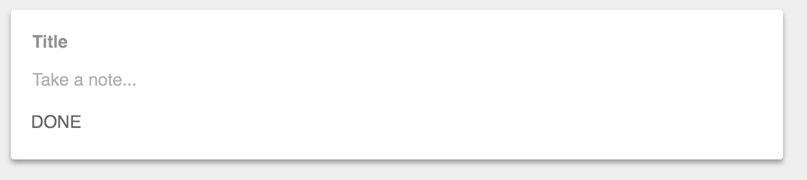

# Cycle.js 学习笔记

## 描述 

A functional and reactive JavaScript framework for predictable code

官方的介绍是一个响应式的框架，完全基于响应式编程的方式。

## 框架思想与架构模型

整个框架是基于响应式编程的方式，而响应式编程是基于设计模式中的观察者模式发展而来的，响应式编程很适合函数式的，并发的场景，特别适合处理实时交互的需求。

>  The selling point for widespread Reactive programming is to build self-responsible modules which focus on their own functionality rather than changing external state. This leads to Separation of Concerns.
>
>  观测者模式，可以写出更加内聚的代码，利于关注点分离

这个框架的设计是基于人机交互模型来设计。请看下下面的人机交互示意图，


这图很简单，就是平时我们操作电脑的交互方式。换成 Web 页面，可以将 Computer 换成 Web UI 界面。用户（图中的 Human）通过浏览页面（用户的 Input，通过眼睛感受到）然后经过大脑的处理，可能会输出一个鼠标点击（比如看到一张图片，想打开看看），Web 界面上的图片被鼠标点击了，这就是 Web 界面的一个输入，然后 JS 代码需要处理一些逻辑，然后输出一个变化的界面（比如放大显示的图片）给用户。

更加细节的方面，可以查看下面的视频是作者在 JSConf 上的演讲介绍，需要翻墙观看。

链接地址:  <https://www.youtube.com/embed/1zj7M1LnJV4>

这个想法非常自然，和用户平时的人机交互模型完全一致。可能大家会觉得没有什么问题，但是开发的同学可以结合下以往的前端项目开发经验，前端开发通常是被视觉交互图驱动的，一般是先通过HTML，CSS还原设计图成网页，然后在网页上添加用户交互相关的逻辑，从而最终实现人机交互。

而 Cycle.js 要求我们先实现交互，界面什么的是交互产生的输出结果而已，这个逻辑反转的思路太厉害了，导致整个代码书写的方式都不太一样了。

请看下图中 Cycle.js 中官网推荐的代码逻辑划分方式，Cycle.js 的主程序是一个永远在监听和响应用户操作的 main 函数，而随着 main 函数中的逻辑逐渐复杂，可以将代码拆分成下图中的 intent, modal, view 三部分。


* intent() function
    * Purpose: interpret DOM events as user’s intended actions
    * Input: DOM source
    * Output: Action Streams
* model() function
    * Purpose: manage state
    * Input: Action Streams
    * Output: State Stream
* view() function
    * Purpose: visually represent state from the Model
    * Input: State Stream
    * Output: Stream of Virtual DOM nodes as the DOM Driver sink

可以类似将 intent 比作 redux 中的action，揣摩用户意图，返回有效数据流， model 对应reducer 或者 connect 那一部分，主要做数据组装，view 仅根据传入的 state 参数复杂渲染逻辑。

前端项目都有收到组件化思想的影响，Cycle.js 也可以通过组件化实现代码复用，Cycle.js 中的组件就是一个函数，介绍上层组件传递下来的 props 流，和事件流，经过处理后返回一个 vitrual dom 流和 value 数据流给父组件。


## 一个最简单的例子

我们来看下一个简单 Cycle.js 的例子，例子中根据 Checkbox 的选中状态输出 ON 和 OFF 状态显示

```jsx
function main(sources) {
  const sinks = {
    DOM: sources.DOM.select('input').events('change')
      .map(ev => ev.target.checked)
      .startWith(false)
      .map(toggled =>
        div([
          input({attrs: {type: 'checkbox'}}), 'Toggle me',
          p(toggled ? 'ON' : 'off')
        ])
      )
  };
  return sinks;
}

run(main, {
  DOM: makeDOMDriver('#app'),
});
```

效果展示

请访问 <https://jsbin.com/makuye/2/embed">

可以看到 Cycle.js 中所有的监听和输出都是通过 Stream 实现的，代码中我们首先是去监听 CheckBox 的 `change` 事件，根据事件中的值，觉得 DOM 输出的界面，这里通过 vitual dom 的函数输出，而一开始没有界面就不会有用户交互的区域，所以陷入了一个蛋生鸡，鸡生蛋的问题了，这里需要给这个监听的数据流一个初始值来解决这个问题。

## 实践

为了更加具体的体会和理解 Cycle.js，我尝试去实现以一个简单的 DEMO，这个 Demo 是参考 AngularClass 的 https://github.com/AngularClass/retain-app，实现一个简单的 Google Keep。

最终我没有能完全实现这个 Demo，我的代码库放在这里。

[代码地址](https://github.com/azzgo/fe-poc/tree/master/packages/cycle.js)

实现中，我感受到的最大的一个问题，就是因为 Cycle.js 的开发流程是从交互开始的，而一开始没有界面，去思考，如何去设计代码就变得非常困难。我在实践中有几个方面的处理，有些代表性，以下一一列举。

**如何实践简单的表单提交功能**

此处的表单是很平常的输入完成表单各项的属性，然后点击完成按钮，提交表单的操作。这里面就涉及到了，需要监听提交按钮的 Click 点击事件，而且需要仅在点击事件后，才去拿表单各项的输入值，


这个在非 Stream 的框架中，通过 JS 的局部作用域变量，或者直接通过 DOM 选择器找到对应元素，很容易就实时拿到对应的值，而在 Cycle.js 中，因为所有的 DOM 元素的事件，元素引用等 DOM 相关读写操作，都需要在 Stream 流里面进行，对应的事件和引用也仅在 Stream 的上下文中存在。

下面我就创建 Note 这个表单作为例子。



这里需要我们在获取到提交按钮的点击事件流后，再将 Note 标题和内容的两条 Stream 合并进来，这样才能在同一个上下文中拿到对应的表单值。

看过官方教材的同学，可能最开始想到使用 `xstream` 的 `combile` 方法组合三条 Stream。

但是请看下这个方法的示意图，这里可以看到虽然这个方法可以组合多个 Stream，但是这里的每一个 Stream 更新，都会合并成一个新的 Stream，而 `xstream` 提供的26个集成操作符中是没有实现我们需要的仅由一个 Stream 触发合并的操作符的。

```
--1----2-----3--------4---
----a-----b-----c--d------
         combine
----1a-2a-2b-3b-3c-3d-4d--
```

这里我们其实需要的是 `sampleCombine` 这个操作符，而这个操作符是在 `xstream` 的扩展包里，可以看到这里合并流的控制权在 `source` Stream 那里。这就完美符合我们的要求了。


```--1----2-----3--------4--- (source)
----a-----b-----c--d------ (other)
     sampleCombine
-------2a----3b-------4d--
```

最后提交表单的代码如下，我们监听表单的点击事件，事件触发后，我们去合并两个表单元素的流，进而拿到对应的值，进行表单验证，然后去发送一个请求去创建 Note，返回的是一个 `@cycle/http` 要求的对象格式。

```jsx
const request$ = DOM.select('#new-note-submit').events('click').map((e) => e.preventDefault())
  .compose(sampleCombine(
    DOM.select('#new-note-title').element(),
    DOM.select('#new-note-value').element()
  ))
  .map(([,titleEl, valueEl]) => {
    const title = titleEl.value
    const value = valueEl.value

    if (!title || !value) {
      return xs.empty()
    }

    // reset 
    titleEl.value = ''
    valueEl.value = ''

    return {
      url: 'http://127.0.0.1:3000/notes',
      method: 'POST',
      category: actionTypes.createNote,
      headers: {
        Authorization: `Bearer ${localStorage.token}`
      },
      send: {
        title,
        value,
      }
    }
  })
 ```
 
**一个组件到底应该返回一个 的 Stream DOM 还是返回一个 Vitual DOM**

你在拆分代码的时候，很容易遇到这个问题，虽然根据上面 `dataflow component` 的参考，你可以都返回一个 Stream。

使用过 React 的小伙伴们可能知道如果需要渲染一个列表的话，一般会习惯直接在代码中使用 `map` 方法。例如如下：

```jsx
const { notes } = this.props

return <div className="list">
    {notes.map(note) => (<NoteCard key={note.id} note={note})}
</div>
```

而如果 `NoteCard` 返回的是一个 Steam 流，那么就需要做一些额外处理才行。

```jsx

const noteCards$ = state$
    .map(({notes}) => {
      return notes.map((note) => {
        return isolate(NoteCard, note.id)({ DOM: DOMSink, props: { note, className: 'col-xs-4' }})
      })
    })
    .map((noteCards) => xs.combine(...noteCards.map((noteCard) => noteCard.DOM)))
    .map(NoteCardViews) => (
        <div className="list">
            {NoteCardViews}
        </div>
    )
```

可以看到我们原先的 Map 逻辑必须预先在 Stream 的变换中处理好。两种写法是非常不一样的，而这种写法，是我根据 `xstream` 的文档逐渐摸索出来的。做参考。

## 结尾

虽然从社区到业界的推广和使用，以及个人的练手感觉，本质上这个框架中还是能看到 React 一系 Elm 框架的单向数据流影子，并且书写中很多最佳实践等相关总结也需要社区能强力的总结出一套出来，不然一个业务场景光思考如何实现，在响应式编程与框架结合中，本人愚笨，脑细胞完全不够用。


但是不得不说 Cycle.js 是一个理念非常出众的框架，作者本身也是 `Rx.js` 的核心贡献者，看下这个框架，增强对响应式编程的理解也是极好的。

